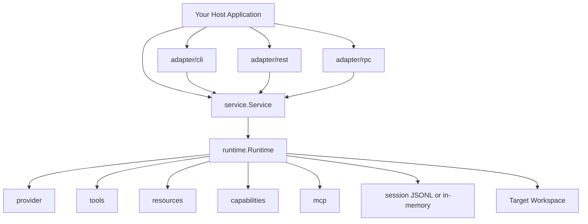
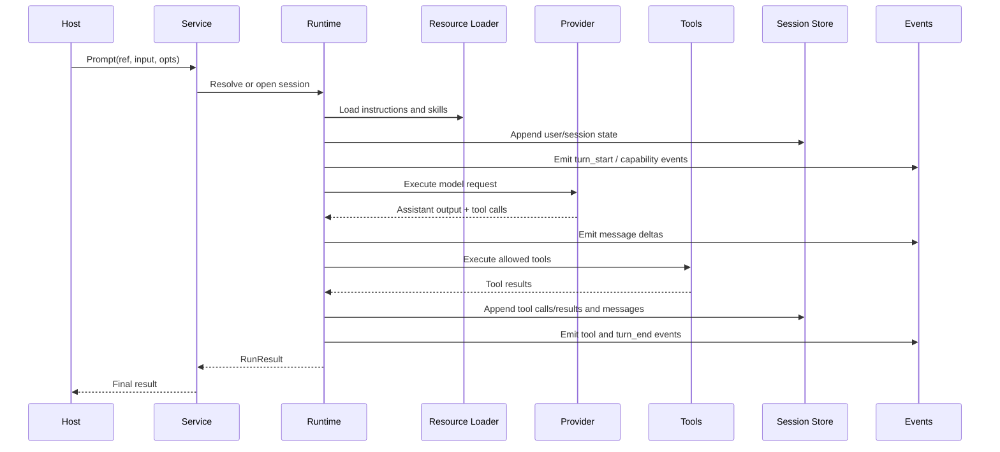
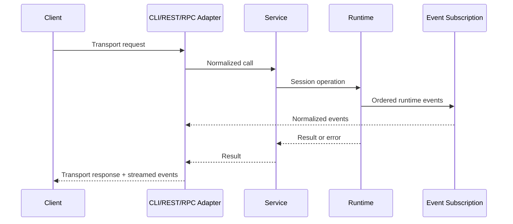
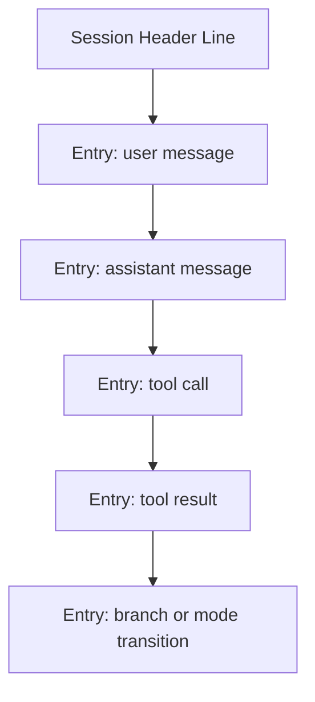
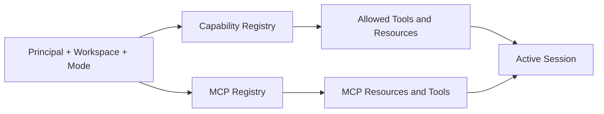
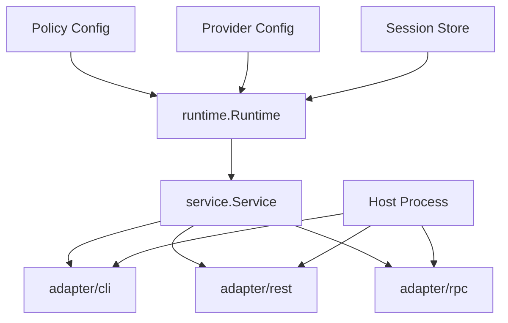

# memoidness

`memoidness` is a library-first Go runtime for building coding agents inspired on [pi coding agent](https://github.com/earendil-works/pi/tree/main/packages/coding-agent).

It gives you one reusable backend surface for:

- scoped sessions
- OpenAI-compatible model execution
- repository instruction loading
- policy-gated filesystem and process tools
- ordered runtime events
- resumable JSONL session persistence
- branching, replay, and navigation
- generated-skill promotion
- thin CLI, REST, and RPC adapter packages

The project is meant to be embedded into another Go application. It is not a packaged end-user agent product.

## Architecture At A Glance



## Status

The current implementation is an MVP backend runtime, but it is already usable for real embedding work.

Implemented:

- session-oriented runtime API
- `service.Service` session coordinator for multi-request hosts
- built-in `read_file`, `write_file`, and `exec` tools
- OpenAI-compatible `/chat/completions` provider
- project instruction discovery from local guidance files
- append-only JSONL session persistence
- scoped MCP-backed resources and tools
- mode-aware capability resolution
- fork, clone, and navigate session branches
- same-process subagents
- workspace-skill promotion
- reusable `adapter/cli`, `adapter/rest`, and `adapter/rpc` packages

Not yet packaged:

- end-user CLI binary
- REST server binary
- standalone RPC daemon

## Installation

Requirements:

- Go `1.24`
- access to an OpenAI-compatible API endpoint

Install:

```bash
go get github.com/latentarts/memoidness
```

## Core Model

The intended dependency direction is:

| Layer | Packages | What It Is |
|---|---|---|
| Core runtime layer | `runtime`, `provider`, `session`, `tools`, `resources`, `capabilities`, `mcp`, `policy`, `types` | The reusable backend engine. This layer owns session behavior, model execution, persistence, tool execution, capability resolution, resource loading, normalized types, and safety policy. |
| Coordination layer | `service` | A thin session coordinator over the runtime. This is the preferred host seam for multi-request systems because it handles session lookup, reopen, and rebinding so transport code does not manage live runtime sessions directly. |
| Transport layer | `adapter/cli`, `adapter/rest`, `adapter/rpc` | Thin transport adapters over `service.Service`. These packages translate terminal commands, HTTP requests, or framed RPC messages into normalized service calls and stream runtime events back outward. |

The runtime owns behavior. Hosts and adapters should stay thin.

Use the layers like this:

- use `runtime.Runtime` directly when you are embedding a single in-process agent and are comfortable holding `runtime.Session` values yourself
- use `service.Service` when you are building any multi-request or transport-facing host
- use adapter packages when you want a ready-made transport seam over `service.Service`

## Main Runtime Flow



## Transport Flow



## Features

### Sessions

Sessions support:

| Operation | Description |
|---|---|
| `Prompt` | Run a user turn through the model and tool loop. |
| `Steer` | Queue developer-style guidance while a turn is active. |
| `FollowUp` | Queue another user-style input while a turn is active. |
| `Abort` | Cancel the currently running turn. |
| `SetMode` | Change the active session mode, such as `plan` or `implementation`. |
| `Fork` | Create a new branch from the current or earlier session history. |
| `Clone` | Copy the current session history into a new branch. |
| `Navigate` | Replay the session to an earlier visible entry. |
| `PromoteSkill` | Persist an ephemeral generated skill to workspace scope. |
| `Compact` | Append a summary record for compaction-oriented workflows. |
| `Subscribe` | Receive ordered runtime events for the session. |
| `Snapshot` | Read the current session state and visible message history. |

Each session runs through one serialized mutation loop, so prompts, tool calls, persistence, and events all go through the same path.

### Provider

The built-in provider supports:

- custom base URL
- API key injection
- non-streaming chat completions
- streaming assistant deltas
- tool-call decoding

### Tools

Built-in tools:

| Tool | Description |
|---|---|
| `read_file` | Read a UTF-8 text file under allowed readable roots. |
| `write_file` | Write or append UTF-8 text under allowed writable roots. |
| `exec` | Run an allowed process and stream `stdout` and `stderr` updates. |

All tool execution is gated by explicit policy.

### Persistence

The JSONL session manager supports:

- create
- append
- open by session id
- continue recent by principal/workspace scope
- list
- fork
- clone
- navigate to an earlier entry

The durable format is append-only JSONL:

- first line: session metadata
- later lines: session entries



### Capability And MCP Support

The runtime supports:

- plan vs implementation mode
- mode-based tool narrowing
- scoped MCP-backed resources
- scoped MCP-backed tools
- same-process subagent orchestration



### Adapter Packages

Available reusable adapter packages:

- `adapter/cli`
- `adapter/rest`
- `adapter/rpc`

These are library packages, not packaged binaries.

## Correct Integration Pattern

For most production-style hosts, the correct pattern is:

1. resolve principal and workspace identity at the host edge
2. configure provider, policy, persistence, and optional MCP dependencies
3. build one `runtime.Runtime`
4. wrap it in one long-lived `service.Service`
5. mount CLI, REST, or RPC transport behavior on top of `service.Service`
6. stream normalized runtime events outward without inventing a second orchestration path

Do not put transport-specific business logic into `runtime`.

## Recommended Deployment Shape



## Quick Start

### Recommended Host Wiring With `service.Service`

```go
package main

import (
	"context"
	"fmt"
	"log"
	"net/http"
	"os"
	"path/filepath"

	"github.com/latentarts/memoidness/policy"
	"github.com/latentarts/memoidness/provider"
	"github.com/latentarts/memoidness/runtime"
	"github.com/latentarts/memoidness/service"
	"github.com/latentarts/memoidness/session"
	"github.com/latentarts/memoidness/types"
)

func main() {
	ctx := context.Background()

	targetRepo := "/path/to/repo"
	storeDir := filepath.Join(targetRepo, ".memoidness", "sessions")

	sessionManager, err := session.NewJSONLManager(storeDir)
	if err != nil {
		log.Fatal(err)
	}

	modelProvider := provider.NewOpenAICompatibleProvider(provider.OpenAIConfig{
		ID:      "openai-like",
		BaseURL: "https://your-openai-compatible-host/v1",
		APIKey:  os.Getenv("OPENAI_API_KEY"),
		Client:  http.DefaultClient,
	})

	rt := runtime.New(runtime.Config{
		Providers:      provider.NewStaticRegistry("openai-like", modelProvider),
		SessionManager: sessionManager,
		Policy: policy.RuntimePolicy{
			Filesystem: policy.FilesystemPolicy{
				ReadableRoots: []string{targetRepo},
				WritableRoots: []string{targetRepo},
			},
			Process: policy.ProcessPolicy{
				AllowedCommands: []string{
					"git status",
					"go test",
					"rg",
				},
			},
		},
	})

	svc := service.New(rt, sessionManager)

	snapshot, err := svc.CreateSession(ctx, service.CreateSessionRequest{
		Options: runtime.SessionOptions{
			Model: types.ModelRef{
				ProviderID: "openai-like",
				ID:         "gpt-4.1-mini",
			},
			Scope: types.SessionScope{
				Principal: types.PrincipalRef{ID: "user-1"},
				Workspace: types.WorkspaceSpec{
					Ref:        types.WorkspaceRef{ID: "repo-1"},
					Kind:       "local",
					WorkingDir: targetRepo,
				},
			},
			Persistence: types.PersistenceModeSession,
		},
	})
	if err != nil {
		log.Fatal(err)
	}

	ref := types.SessionRef{
		ID:        snapshot.SessionID,
		Principal: snapshot.Scope.Principal.ID,
		Workspace: snapshot.Scope.Workspace.Ref.ID,
	}

	_, err = svc.Subscribe(ctx, ref, func(ev any) {
		fmt.Printf("event: %#v\n", ev)
	})
	if err != nil {
		log.Fatal(err)
	}

	result, err := svc.Prompt(ctx, ref, types.UserInput{
		Text: "Read the repository guidance and explain the test layout.",
	}, types.PromptOptions{
		Stream: true,
	})
	if err != nil {
		log.Fatal(err)
	}

	fmt.Println(result.FinalOutput.Parts[0].Text)
}
```

### Direct Runtime Integration

Use direct runtime integration only when you do not need a session coordinator:

Assuming `rt` was built as in the previous example:

```go
sess, err := rt.NewSession(ctx, runtime.SessionOptions{
	Model: types.ModelRef{
		ProviderID: "openai-like",
		ID:         "gpt-4.1-mini",
	},
	Scope: types.SessionScope{
		Principal: types.PrincipalRef{ID: "user-1"},
		Workspace: types.WorkspaceSpec{
			Ref:        types.WorkspaceRef{ID: "repo-1"},
			Kind:       "local",
			WorkingDir: targetRepo,
		},
	},
	Persistence: types.PersistenceModeSession,
})
if err != nil {
	log.Fatal(err)
}

result, err := sess.Prompt(ctx, types.UserInput{
	Text: "Summarize the repository layout.",
}, types.PromptOptions{
	Stream: true,
})
if err != nil {
	log.Fatal(err)
}

fmt.Println(result.FinalOutput.Parts[0].Text)
```

## Using `service.Service`

`service.Service` is the preferred seam for hosts.

Available operations:

| Operation | Description |
|---|---|
| `CreateSession` | Create a new scoped session and return its initial snapshot. |
| `OpenSession` | Reopen an existing session by explicit session reference. |
| `ContinueRecent` | Open the most recent session for a principal/workspace scope. |
| `Prompt` | Run a prompt against a resolved session. |
| `Steer` | Send developer-style steering input to an active run. |
| `FollowUp` | Send user-style follow-up input to an active run. |
| `Abort` | Cancel an active run. |
| `Fork` | Create a new branch from a visible entry. |
| `Clone` | Copy the current branch into a new session branch. |
| `Navigate` | Replay the session to an earlier entry. |
| `PromoteSkill` | Persist a generated skill into durable workspace scope. |
| `SetMode` | Switch the active mode for a session. |
| `Snapshot` | Read the latest session snapshot. |
| `Subscribe` | Attach an event listener to a session. |

### Open Or Continue A Session

```go
snapshot, err := svc.OpenSession(ctx, types.SessionRef{
	ID:        "session-123",
	Principal: "user-1",
	Workspace: "repo-1",
})
if err != nil {
	log.Fatal(err)
}

recent, err := svc.ContinueRecent(ctx, service.ContinueRecentRequest{
	Scope: session.Scope{
		Principal: "user-1",
		Workspace: "repo-1",
	},
})
if err != nil {
	log.Fatal(err)
}

_ = snapshot
_ = recent
```

### Prompt, Steer, Follow Up, Abort

```go
result, err := svc.Prompt(ctx, ref, types.UserInput{
	Text: "Inspect the repository and propose a plan.",
}, types.PromptOptions{
	Stream: true,
})
if err != nil {
	log.Fatal(err)
}

_ = result

if err := svc.Steer(ctx, ref, types.UserInput{
	Text: "Focus on persistence and tests.",
}); err != nil {
	log.Fatal(err)
}

if err := svc.FollowUp(ctx, ref, types.UserInput{
	Text: "Now summarize the main risks.",
}); err != nil {
	log.Fatal(err)
}

if err := svc.Abort(ctx, ref); err != nil {
	log.Fatal(err)
}
```

`Steer` and `FollowUp` only make sense while a prompt is actively running.

### Set Mode

```go
snapshot, err := svc.SetMode(ctx, ref, types.ModeRef{ID: "plan"})
if err != nil {
	log.Fatal(err)
}

fmt.Println(snapshot.Mode.ID)
```

### Branching And Navigation

```go
forked, err := svc.Fork(ctx, ref, types.EntryRef{ID: "msg-5"})
if err != nil {
	log.Fatal(err)
}

cloned, err := svc.Clone(ctx, ref)
if err != nil {
	log.Fatal(err)
}

navigated, err := svc.Navigate(ctx, ref, types.EntryRef{ID: "msg-5"})
if err != nil {
	log.Fatal(err)
}

_ = forked
_ = cloned
_ = navigated
```

`Fork` and `Navigate` can use ids from visible message or tool history. The runtime resolves them to persisted entry ids.

### Promote A Generated Skill

```go
result, err := svc.PromoteSkill(ctx, ref, types.SkillPromotionRequest{
	Name:   "generated-write-tests",
	Target: types.SkillPromotionTargetWorkspace,
})
if err != nil {
	log.Fatal(err)
}

fmt.Println(result.Path)
```

## Event Consumption

Runtime events are the correct live integration surface for:

- terminal streaming
- HTTP event streaming
- RPC event forwarding
- logs
- orchestration and monitoring

Example:

```go
unsubscribe, err := svc.Subscribe(ctx, ref, func(ev any) {
	fmt.Printf("runtime event: %#v\n", ev)
})
if err != nil {
	log.Fatal(err)
}
defer unsubscribe()
```

Current event families include:

| Event Family | Description |
|---|---|
| `agent_start` | Marks the beginning of a top-level run. |
| `agent_end` | Marks the end of a top-level run. |
| `turn_start` | Marks the beginning of a prompt turn. |
| `turn_end` | Marks the end of a prompt turn. |
| `message_delta` | Streams incremental assistant text output. |
| `queue_update` | Reports queued `Steer` or `FollowUp` inputs. |
| `tool_execution_start` | Marks the start of a tool invocation. |
| `tool_execution_update` | Streams progress from a running tool. |
| `tool_execution_end` | Marks the end of a tool invocation. |
| `capability_resolution` | Reports the effective capability set for the run. |
| `capability_denial` | Reports a denied tool, mode, or orchestration action. |
| `mcp_server_resolution` | Reports the effective MCP server set for the run. |
| `mcp_server_session_start` | Marks the start of an MCP-backed session lifecycle. |
| `mcp_server_session_end` | Marks the end of an MCP-backed session lifecycle. |
| `subagent_start` | Marks the start of a child-session delegation. |
| `subagent_end` | Marks the end of a child-session delegation. |
| `session_fork` | Reports branch creation through `Fork`. |
| `session_clone` | Reports branch creation through `Clone`. |
| `session_navigate` | Reports replay to an earlier entry. |
| `skill_promotion` | Reports durable promotion of a generated skill. |
| `error` | Reports a runtime-level failure or terminal error condition. |

## What The Runtime Loads From The Repository

Before the first prompt in a session, the default filesystem resource loader scans the working directory and optional context roots for instruction files:

- `AGENTS.md`
- `CODEX.md`
- `CLAUDE.md`
- `CURSOR.md`
- `GEMINI.md`
- `PI.md`

These are loaded into the model request as instructions.

The default loader also discovers workspace skills under:

- `.memoidness/skills/*.md`

`policy.ResourcePolicy.StopPaths` is respected during discovery.

## Policy

You are expected to configure policy explicitly.

Important knobs:

| Policy Field | Description |
|---|---|
| `Filesystem.ReadableRoots` | Roots that `read_file` may access. |
| `Filesystem.WritableRoots` | Roots that `write_file` may modify. |
| `Process.AllowedCommands` | Command prefixes that `exec` may run. |
| `Process.NetworkAccess` | Host-declared network posture for process execution. |
| `Resources.StopPaths` | Discovery boundaries for instruction and skill loading. |

Example:

```go
policy.RuntimePolicy{
	Filesystem: policy.FilesystemPolicy{
		ReadableRoots: []string{targetRepo},
		WritableRoots: []string{targetRepo},
	},
	Process: policy.ProcessPolicy{
		AllowedCommands: []string{
			"git status",
			"go test",
			"rg",
		},
	},
}
```

If a tool violates policy, the runtime returns a structured tool error rather than bypassing the runtime.

## Persistence

The recommended durable setup is to store sessions in a project-local directory:

- `.memoidness/sessions`

Example:

```go
storeDir := filepath.Join(targetRepo, ".memoidness", "sessions")
manager, err := session.NewJSONLManager(storeDir)
if err != nil {
	log.Fatal(err)
}
```

This supports:

- process restart recovery
- continue recent by principal/workspace
- branch persistence
- later replay or inspection

## Adapters

All adapters are thin library packages over `service.Service`.

### CLI Adapter

Package:

- `github.com/latentarts/memoidness/adapter/cli`

Use it when you want a terminal-oriented command surface inside your own binary.

Example:

```go
cliAdapter, err := cli.New(cli.Config{
	Service:           svc,
	Stdout:            os.Stdout,
	Stderr:            os.Stderr,
	DefaultPrincipal:  "user-1",
	DefaultWorkspace:  "repo-1",
	DefaultWorkingDir: targetRepo,
	DefaultModel: types.ModelRef{
		ProviderID: "openai-like",
		ID:         "gpt-4.1-mini",
	},
	DefaultStream: true,
})
if err != nil {
	log.Fatal(err)
}

if err := cliAdapter.Run(ctx, []string{
	"create",
	"--principal", "user-1",
	"--workspace", "repo-1",
	"--dir", targetRepo,
}); err != nil {
	log.Fatal(err)
}
```

Current commands:

| Command | Description |
|---|---|
| `create` | Create a new session from CLI arguments. |
| `open` | Open an existing session by explicit session id and scope. |
| `continue` | Reopen the most recent scoped session. |
| `prompt` | Run a prompt and optionally stream output. |
| `snapshot` | Print the current session snapshot. |
| `set-mode` | Change the session mode. |
| `fork` | Create a new branch from a visible entry id. |
| `clone` | Clone the current branch into a new session. |
| `navigate` | Replay the session to an earlier visible entry id. |
| `promote-skill` | Persist a generated skill to workspace scope. |
| `steer` | Queue steering input into an active run. |
| `follow-up` | Queue follow-up input into an active run. |
| `abort` | Cancel the active run. |

### REST Adapter

Package:

- `github.com/latentarts/memoidness/adapter/rest`

Use it when you want to mount the runtime into an existing HTTP server.

Example:

```go
restAdapter, err := rest.New(rest.Config{
	Service:  svc,
	BasePath: "/api",
})
if err != nil {
	log.Fatal(err)
}

mux := http.NewServeMux()
mux.Handle("/api/", restAdapter.Handler())

if err := http.ListenAndServe(":8080", mux); err != nil {
	log.Fatal(err)
}
```

Current endpoints:

| Endpoint | Description |
|---|---|
| `POST /sessions` | Create a new session. |
| `POST /sessions/continue` | Open the most recent scoped session. |
| `GET /sessions/{session_id}` | Read the current snapshot for a session. |
| `POST /sessions/{session_id}/prompt` | Run a prompt against a session. |
| `POST /sessions/{session_id}/steer` | Queue steering input for an active run. |
| `POST /sessions/{session_id}/follow-up` | Queue follow-up input for an active run. |
| `POST /sessions/{session_id}/abort` | Cancel the active run. |
| `POST /sessions/{session_id}/mode` | Change the active mode. |
| `POST /sessions/{session_id}/fork` | Create a new branch from an earlier entry. |
| `POST /sessions/{session_id}/clone` | Clone the current branch into a new session. |
| `POST /sessions/{session_id}/navigate` | Replay the session to an earlier entry. |
| `POST /sessions/{session_id}/promote-skill` | Persist a generated skill to workspace scope. |
| `GET /sessions/{session_id}/events` | Stream normalized runtime events as SSE. |

Example request:

```http
POST /api/sessions HTTP/1.1
Content-Type: application/json

{
  "scope": {
    "Principal": { "ID": "user-1" },
    "Workspace": {
      "Ref": { "ID": "repo-1" },
      "Kind": "local",
      "WorkingDir": "/path/to/repo"
    }
  },
  "model": {
    "ProviderID": "openai-like",
    "ID": "gpt-4.1-mini"
  },
  "persistence": "session"
}
```

Event streaming currently uses server-sent events from `GET /sessions/{session_id}/events`.

For session-targeted REST routes, the current adapter expects `principal` and `workspace` as query parameters alongside the session id.

### RPC Adapter

Package:

- `github.com/latentarts/memoidness/adapter/rpc`

Use it when you want an out-of-process command-and-event stream over a duplex connection.

Example:

```go
func serveRPC(ctx context.Context, conn net.Conn, svc *service.Service) error {
	rpcServer, err := rpc.New(rpc.Config{
		Service: svc,
	})
	if err != nil {
		return err
	}
	return rpcServer.Serve(ctx, conn)
}
```

The first-pass RPC framing is line-oriented JSON.

Request envelope:

```json
{"id":"req-1","method":"prompt","params":{"ref":{"id":"session-1","principal":"user-1","workspace":"repo-1"},"input":{"text":"inspect repo"},"options":{"stream":true}}}
```

Response envelope:

```json
{"id":"req-1","type":"response","method":"prompt","payload":{...}}
```

Event envelope:

```json
{"id":"sub-1","type":"event","method":"subscribe","payload":{...}}
```

Current RPC methods:

| RPC Method | Description |
|---|---|
| `create_session` | Create a new scoped session. |
| `open_session` | Reopen an existing session by reference. |
| `continue_session` | Open the most recent scoped session. |
| `prompt` | Run a prompt and return a normalized run result. |
| `snapshot` | Return the current session snapshot. |
| `set_mode` | Change the active mode. |
| `fork` | Create a new branch from an earlier entry. |
| `clone` | Clone the current branch into a new session. |
| `navigate` | Replay the session to an earlier entry. |
| `promote_skill` | Persist a generated skill to workspace scope. |
| `steer` | Queue steering input for an active run. |
| `follow_up` | Queue follow-up input for an active run. |
| `abort` | Cancel the active run. |
| `subscribe` | Subscribe to normalized runtime events on the same stream. |

## Integration Guidance

Recommended:

- keep one long-lived `service.Service` per host process
- keep sessions under a project-local persistence directory
- use explicit principal and workspace ids for every host request
- use `Prompt(..., Stream: true)` for interactive hosts
- subscribe to events instead of polling internal state
- restrict file and process permissions aggressively

Avoid:

- putting transport-specific logic into `runtime`
- letting adapters invent their own session semantics
- relying on unconstrained file or process policy

## Testing

Run the suite with:

```bash
env GOCACHE=/tmp/memoidness-gocache go test ./...
```

In restricted environments, the explicit `GOCACHE` override may be necessary if the default Go build cache path is not writable.

## Limitations

Current MVP limitations:

- no packaged end-user CLI binary
- no packaged REST server binary
- no standalone RPC server process
- no principal/global skill promotion yet
- no distributed subagent execution yet
- no provider families beyond OpenAI-compatible chat-completions APIs
- context discovery is intentionally small and focused on top-level guidance files plus workspace skills
- history inspection surfaces are still thin across the adapter trio

## Summary

`memoidness` is currently a usable backend runtime for embedding coding-agent behavior into another Go application. If you need a Go-native session loop with policy-gated tools, repository instruction loading, resumable sessions, ordered events, and thin reusable CLI, REST, and RPC adapter packages, the current codebase is ready to integrate. If you need a packaged end-user agent product, richer host surfaces and deeper session inspection are still pending.

---

## License

MIT - [License](LICENSE)